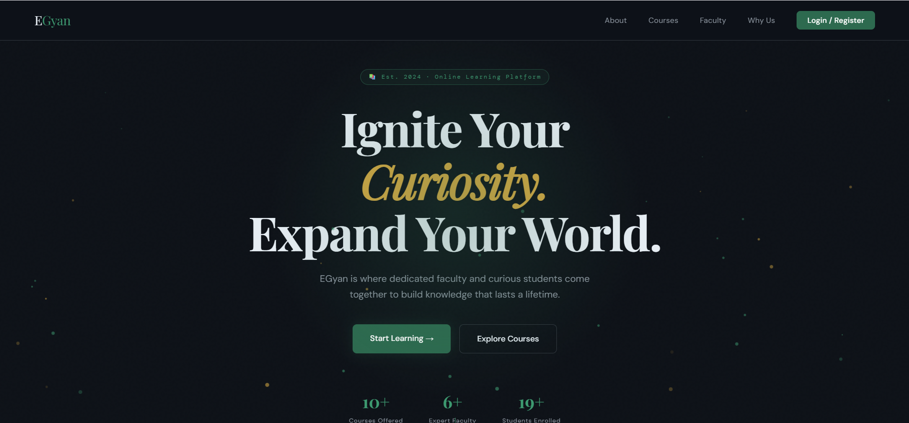
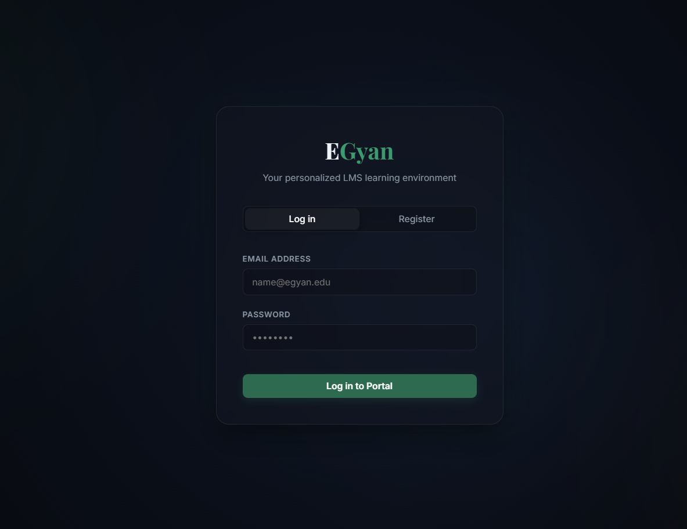
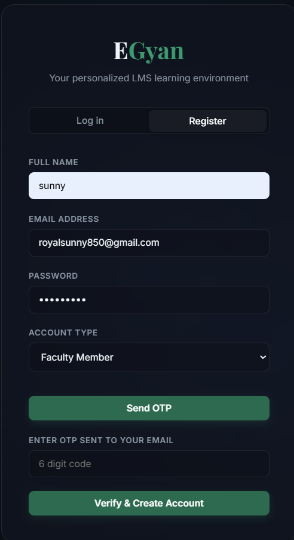
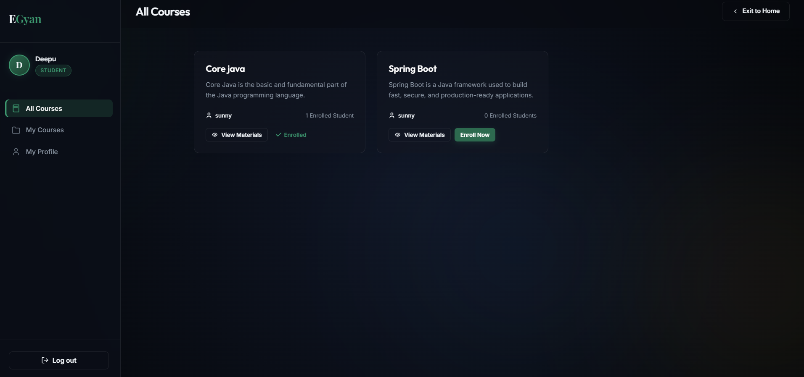
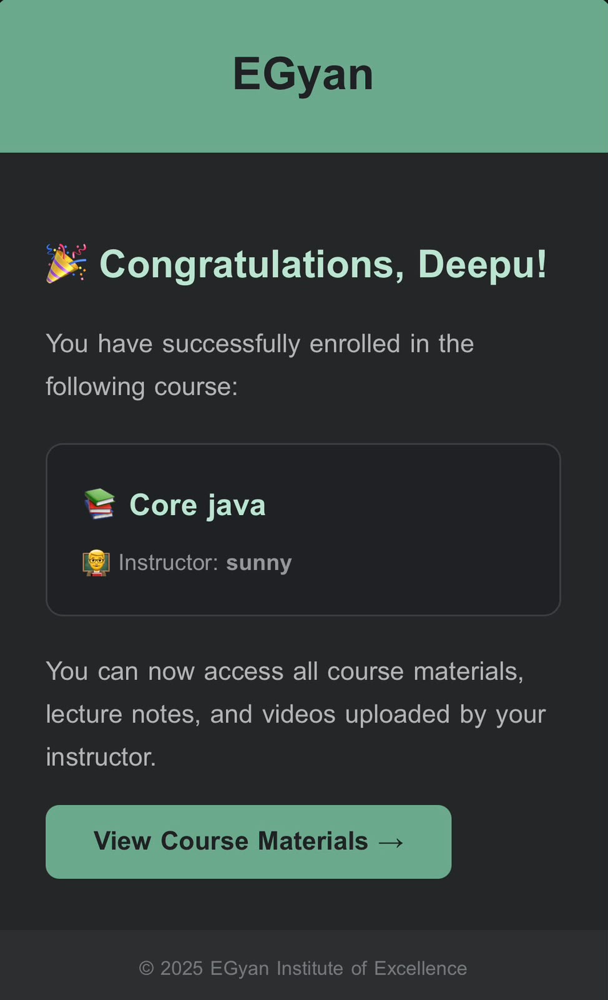
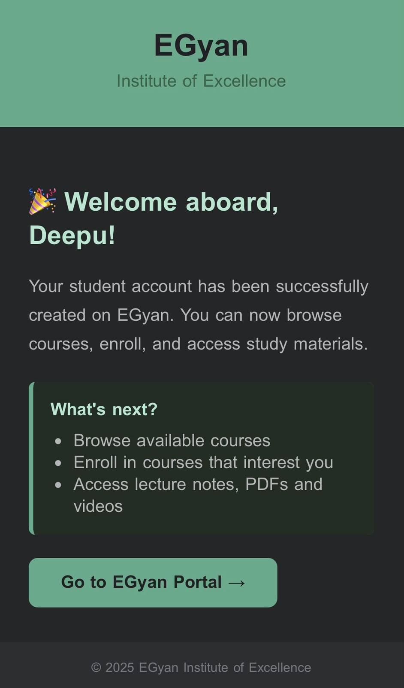
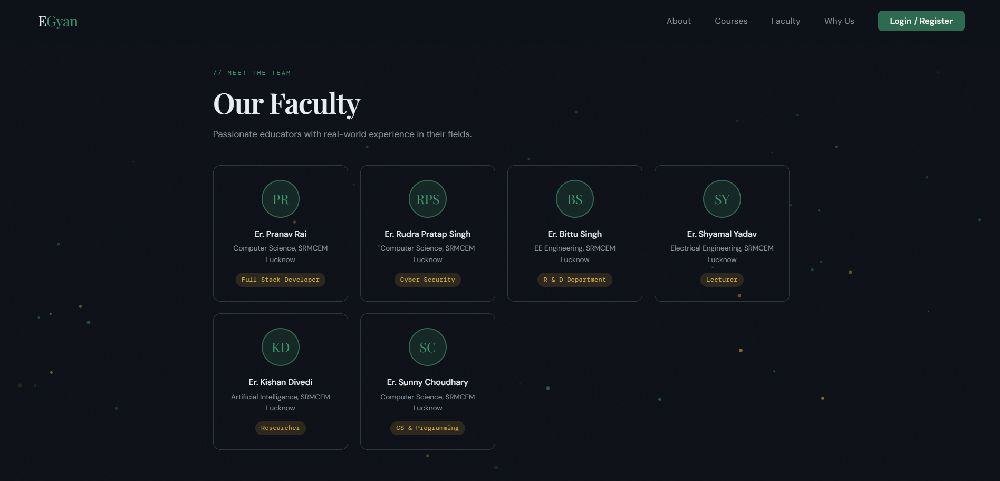
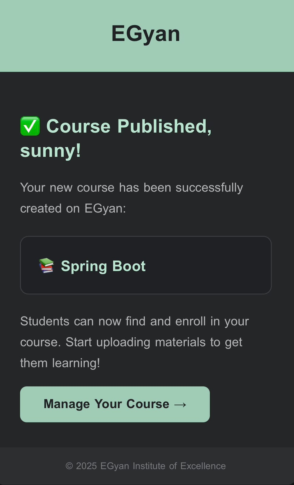
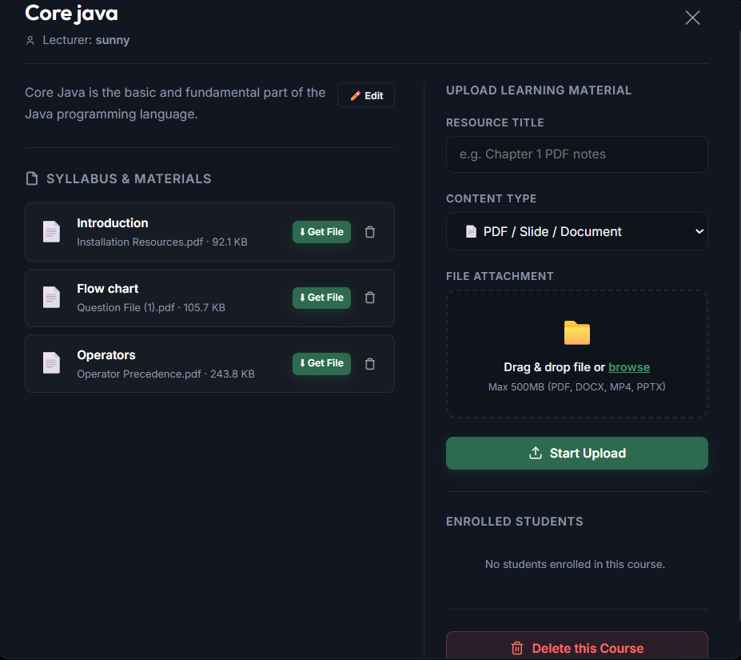
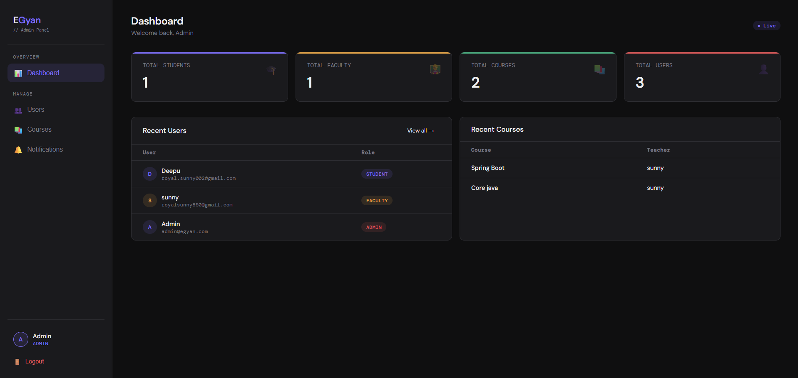

# EGyan — Institute of Excellence
This project is a full-stack Learning Management System (LMS) built with Spring Boot and vanilla JavaScript, designed to connect passionate educators with curious students through a clean and modern web platform.

# 🎓 EGyan — Learning Management System


## 📘 Project Overview
EGyan is a role-based Learning Management System that allows faculty to create and manage courses, upload study materials, and communicate with students through automated email notifications.  
Students can register with OTP verification, browse available courses, enroll, and access multimedia content uploaded by their instructors.  
The platform also includes a dedicated **Admin Panel** for managing users and courses across the system.

---

## 👥 User Roles

### 👨‍🎓 Student
- Register with OTP email verification
- Browse and enroll in available courses
- Access and download course materials (PDF, DOCX, PPTX, MP4)
- Watch video lectures directly in the browser
- Receive enrollment confirmation via email

### 👨‍🏫 Faculty
- Create and manage courses with title and description
- Upload multimedia materials (PDF, MP4, DOCX) up to 500MB via drag-and-drop
- Edit course descriptions inline
- View list of enrolled students
- Receive course creation confirmation via email

### 🛡️ Admin
- View live dashboard stats (total students, faculty, courses)
- Search, filter and delete users by role
- Manage and delete any course on the platform
- Send platform-wide broadcast notifications

---

## 🛠️ Tech Stack

| Layer | Technology |
|-------|-----------|
| Backend | Java 17, Spring Boot 3.5 |
| Security | Spring Security, BCrypt Password Encoding |
| Database | MySQL 8.0, Spring Data JPA, Hibernate |
| Email | JavaMailSender, Gmail SMTP |
| Frontend | HTML5, CSS3, Vanilla JavaScript |
| Build Tool | Apache Maven |

---

## 📁 Project Structure

```
egyan/
├── src/main/java/com/egyan/
│   ├── config/               # Security & CORS configuration
│   ├── controller/           # REST API controllers
│   ├── entity/               # JPA entities (User, Course, CourseMaterial)
│   ├── exception/            # Global exception handling
│   ├── repository/           # Spring Data JPA repositories
│   └── service/              # Business logic & email service
├── src/main/resources/
│   └── static/
│       ├── index.html        # Landing page
│       ├── egyan.html        # Student & Faculty portal
│       └── Admin.html        # Admin panel
└── pom.xml
```

---

## ⚙️ Setup & Installation

### Prerequisites
- Java 17 or higher
- MySQL 8.0 or higher
- Maven 3.8 or higher
- Gmail account with App Password enabled

### 1️⃣ Clone the repository
```bash
git clone https://github.com/SunnyChoudhary850/E-Gyan.git
cd E-Gyan
```

### 2️⃣ Create MySQL database
```sql
CREATE DATABASE egyan;
```

### 3️⃣ Configure application properties
Create `src/main/resources/application.properties` with the following:
```properties
spring.datasource.url=jdbc:mysql://localhost:3306/egyan
spring.datasource.username=your_mysql_username
spring.datasource.password=your_mysql_password
spring.jpa.hibernate.ddl-auto=update

spring.mail.host=smtp.gmail.com
spring.mail.port=587
spring.mail.username=your_gmail@gmail.com
spring.mail.password=your_gmail_app_password
spring.mail.properties.mail.smtp.auth=true
spring.mail.properties.mail.smtp.starttls.enable=true
```

### 4️⃣ Run the application
```bash
mvn spring-boot:run
```

### 5️⃣ Access the portals

| Portal | URL |
|--------|-----|
| Landing Page | http://localhost:8080 |
| Student / Faculty Portal | http://localhost:8080/egyan |
| Admin Panel | http://localhost:8080/admin |

---

## 🔑 Default Admin Setup
To create an admin account, insert directly into the database with a BCrypt hashed password:
```sql
INSERT INTO user (name, email, password, role)
VALUES ('Admin', 'admin@egyan.com', '<bcrypt_hashed_password>', 'ADMIN');
```

---

## 📧 Email Notification System
Automated HTML-formatted emails are triggered for the following events:

- ✅ Student welcome email on registration
- ✅ Faculty welcome email on registration
- ✅ OTP verification code on signup
- ✅ Course enrollment confirmation for students
- ✅ Course creation confirmation for faculty

---

## 🔗 API Endpoints

### Users
| Method | Endpoint | Description |
|--------|----------|-------------|
| POST | `/users` | Register a new user |
| POST | `/users/login` | Login with email and password |
| POST | `/users/send-otp` | Send OTP to email |
| POST | `/users/verify-otp` | Verify OTP code |
| GET | `/users` | Get all users (Admin) |
| DELETE | `/users/{id}` | Delete a user (Admin) |

### Courses
| Method | Endpoint | Description |
|--------|----------|-------------|
| GET | `/courses` | Get all courses |
| POST | `/courses/{teacherId}` | Create a new course |
| GET | `/courses/teacher/{teacherId}` | Get courses by faculty |
| GET | `/courses/student/{studentId}` | Get enrolled courses |
| PUT | `/courses/{courseId}/enroll/{studentId}` | Enroll a student |
| PUT | `/courses/{courseId}/teacher/{teacherId}/update` | Update course description |
| DELETE | `/courses/{courseId}/teacher/{teacherId}` | Delete course by faculty |
| DELETE | `/courses/admin/{courseId}` | Delete course by admin |

### Materials
| Method | Endpoint | Description |
|--------|----------|-------------|
| GET | `/materials/{courseId}` | Get all materials for a course |
| POST | `/materials/{courseId}` | Upload a new material |
| GET | `/materials/download/{id}` | Download or stream a material |
| DELETE | `/materials/{id}` | Delete a material |

---

## 📸 Screenshots
> Landing Page · Student Portal · Faculty Dashboard · Admin Panel
## 📸 Screenshots

### Home Page


### Login & Registration



### Student Portal




### Faculty Dashboard




### Admin Dashboard

---

## 👨‍💻 Author

**Sunny**
- 📧 [royalsunny850@gmail.com](mailto:royalsunny850@gmail.com)
- 🔗 [LinkedIn](https://www.linkedin.com/in/sunny-choudhary-4a284230b)
- 🐙 [GitHub](https://github.com/SunnyChoudhary850)
- 📍 Gorakhpur, UP, India

---

<p align="center">Built with ❤️ by Er. Sunny Choudhary</p>
